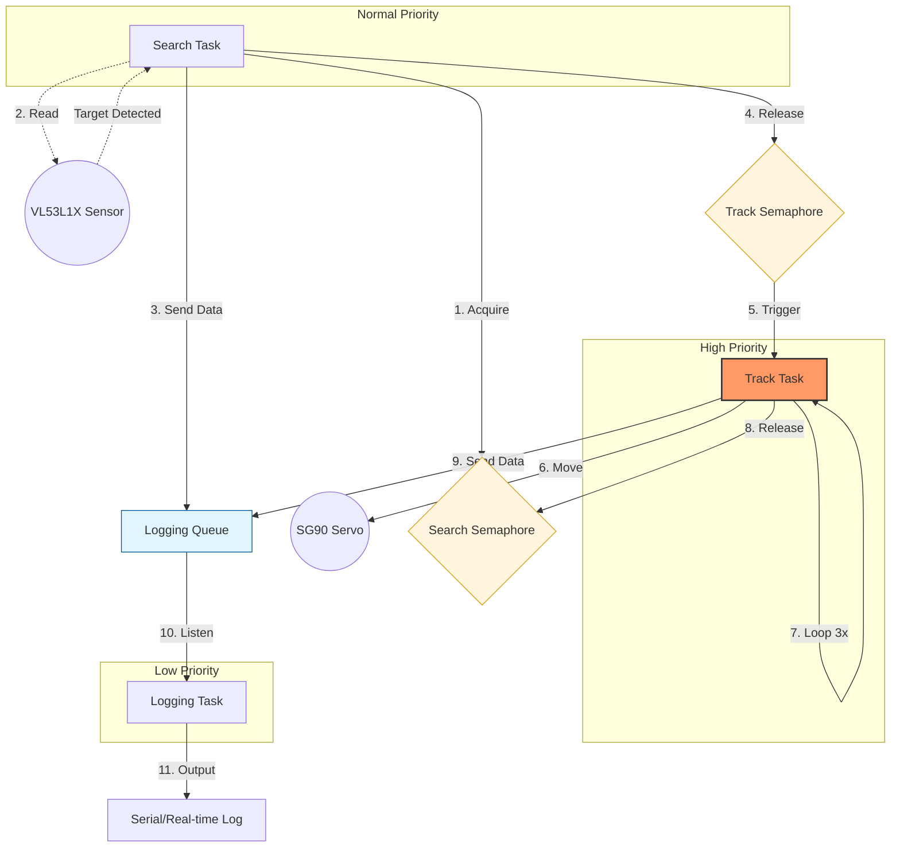

## Radar Emulator
Object in field detector using FreeRTOS on STM32F4 Discovery.

## Hardware Requirements
* MCU: STM32F446RE (Arm® Cortex®-M4 with FPU)
* Board: NUCLEO-F446RE
* Peripherals: SG90 Servo, VL53L1X TOF Sensor

## Software & Toolchain
* IDE: STM32CubeIDE v1.19.0
* RTOS: FreeRTOS Kernel V10.3.1
* HAL: STM32Cube FW_F4 V1.8.5

## Hardware Interface

| Component | Protocol | Peripheral | Description |
| :--- | :--- | :--- | :--- |
| **Servo** | PWM | TIM2 / CH1 | Controls physical sweep angle via pulse width modulation. |
| **Sensor** | I2C | I2C1 | High-speed data link for Time-of-Flight distance measurements. | 
| **Logging** | UART | USART2 | Provides real-time task execution logs to the console. | 

## RTOS Architecture

| Task Name | Priority | Stack Size | Description |
| :--- | :--- | :--- | :--- |
| **Search Task** | Normal | 256 | Reads I2C sensor every 100ms |
| **Track Task** | High | 256 | Tracks object detected during the scan with revisits | 
| **Log Task** | Low | 512 | Logs search data | 

## How to Build and Flash

1. **Clone** the repo.
2. **Import** the project into STM32CubeIDE (File -> Import -> Existing Projects into Workspace).
3. **Build**: Click the Hammer icon.
4. **Flash**: Connect your ST-LINK and click the Play/Debug icon.

## Pin Configuration
Hardware configuration (I2C, PWM) is handled via the **.ioc** file. Update pin layout if needed.
